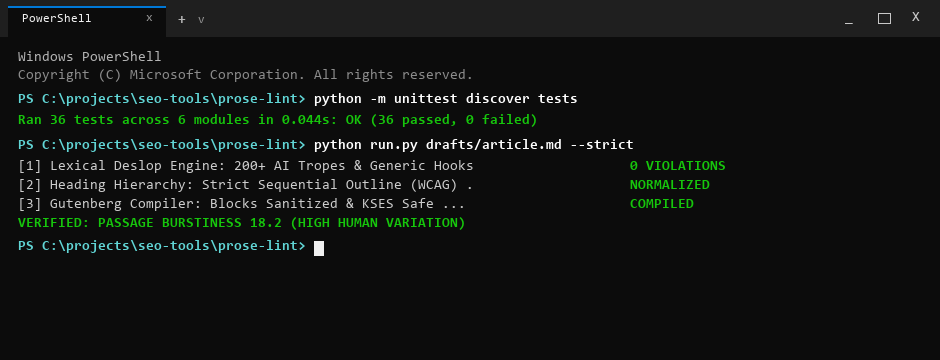

# ProseLint

> [!NOTE]
> **Public Architecture & Distribution Notice**: This repository provides the open-source CLI interface, demonstration fixtures, and automated test suite. Full-scale headless browser automation, real-time CDP continuous profiling, and automated white-label client PDF reporting are exclusively hosted on the [WebAudits.pro](https://www.webaudits.pro) cloud platform.


> Deterministic Editorial Compiler, Deslop Quality Gate, and Multi-Channel Content Transpiler.

ProseLint is a fast, zero-external-API editorial compiler and quality gate designed for modern technical writing, search engine optimization, and generative engine optimization (GEO). Instead of functioning as an unconstrained generative wrapper, ProseLint acts as a deterministic linter that audits drafts against lexical AI markers, enforces natural sentence burstiness, optimizes passage chunks for LLM citations, compiles clean WordPress Gutenberg block comments, and transpiles pillar articles into multi-channel distribution formats.

Part of the [WebAudits.pro](https://webaudits.pro) technical intelligence platform.

> **Interactive Web Tool**: Run live AI deslop, cadence burstiness, and GEO citability audits directly in your browser at [webaudits.pro/tools/prose-lint](https://webaudits.pro/tools/prose-lint).



---

## Key Capabilities

- **Lexical Deslop Engine**: Flags and neutralizes over 200 predictable AI tropes (`delve`, `tapestry`, `testament to`, `landscape`, `pivotal`, `beacon`, `serves as`, `game changer`), throat-clearing openers, signposted conclusions, and formulaic bold-first bullet leads.
- **Cadence & Burstiness Meter**: Measures sentence length variance using standard deviation. Natural human writing exhibits high burstiness (mixing short punchy sentences with longer rhythmic explanations). Metronomic, uniform writing is detected and flagged before publication.
- **GEO AI Search Citability**: Evaluates passage chunking against Princeton KDD 2024 Generative Engine Optimization research. Detects optimal 134-167 word informational blocks, quantifies empirical proof density (metrics, units, percentages), and scores direct answer definition blocks under H2 and H3 question headers.
- **WordPress Gutenberg Delimiter Compiler**: Converts Markdown directly into sanitized Gutenberg comments (`<!-- wp:heading -->`, `<!-- wp:paragraph -->`, `<!-- wp:table -->`, `<!-- wp:list -->`) while neutralizing raw ampersand entities to protect against WordPress KSES corruption (`&#038;&#038;`).
- **Multi-Channel Repurposing Transpiler**: Automatically generates a 135-145 word 60-second ElevenLabs audio script with SSML pause tags, 5-stage cinematography prompts for Sora and Runway, Pinterest 2:3 vertical pin metadata bundles, and `llms.txt` executive citation passages.
- **Strict Punctuation Invariant Enforcement**: Flags forbidden em-dashes and en-dashes across all drafts, enforcing clean typographic standards.

---

## Architecture Overview

```
[ Markdown / HTML Draft ]
            │
            ▼
┌────────────────────────────────────────────────────────┐
│                      PROSE-LINT                        │
├────────────────────────────────────────────────────────┤
│ • Lexical Rule Engine (200+ Compiled Deslop Regexes)   │
│ • Stylometric & Burstiness Cadence Analyzer            │
│ • GEO AI Answer Engine Citability Evaluator            │
│ • WordPress Gutenberg Delimiter Compiler               │
│ • Multi-Channel Content Transpiler                     │
└────────────────────────────────────────────────────────┘
            │
            ▼
┌────────────────────────────────────────────────────────┐
│                    OUTPUT FORMATS                      │
├──────────────────────────┬─────────────────────────────┤
│ Editorial Quality Gate   │ Multi-Channel Production    │
│ • Rich Terminal Table    │ • ElevenLabs SSML Script    │
│ • Machine-Readable JSON  │ • 5-Stage Video Prompts     │
│ • Clean Gutenberg HTML   │ • Pinterest 2:3 Pin Bundle  │
│ • Markdown Audit Summary │ • llms.txt Citation Block   │
└──────────────────────────┴─────────────────────────────┘
```

---

## Installation

```bash
# Clone repository
git clone https://github.com/xcalibur73/prose-lint.git
cd prose-lint

# Install dependencies
pip install -r requirements.txt

# Or install locally in editable mode
pip install -e .
```

---

## Command-Line Usage

```bash
# Audit an article with rich visual terminal output
python run.py article.md

# Audit with JSON output for automated CI/CD pipelines
python run.py article.md --output json --save audit_report.json

# Transpile Markdown draft into sanitized WordPress Gutenberg block comments
python run.py article.md --output gutenberg --save post_content.html

# Generate multi-channel distribution assets (audio, video, Pinterest, llms.txt)
python run.py article.md --repurpose

# Automatically fix simple invariants (strip em-dashes, clean bold-first bullets)
python run.py article.md --fix

# Enforce strict zero-warning policy and custom GEO score threshold
python run.py article.md --strict --threshold 75.0
```

---

## CLI Options

| Flag | Description |
| :--- | :--- |
| `file` | Target Markdown or text file path to audit. |
| `--output, -o` | Output format: `terminal` (default), `json`, `markdown`, or `gutenberg`. |
| `--repurpose` | Generates video prompts, ElevenLabs script, Pinterest pins, and llms.txt snippet. |
| `--threshold` | Minimum GEO citability score required to pass (default: 65.0). |
| `--strict` | Treats warnings as errors; exits with code 1 if any warning is triggered. |
| `--fix` | Automatically applies deterministic fixes (removes em-dashes, cleans bold leads). |
| `--save` | File path to persist output report or transpiled markup. |
| `--version` | Displays current version and exits. |

---

## Companion Ecosystem Tools

ProseLint forms the content execution arm of the WebAudits open-source suite:

- [SchemaGraph](https://github.com/xcalibur73/schema-graph): Cross-page Schema.org knowledge graph and entity integrity validator.
- [CitationPulse](https://github.com/xcalibur73/citation-pulse): Generative Engine Optimization crawler and robots.txt audit engine.
- [DOMHydrate](https://github.com/xcalibur73/dom-hydrate): Server-rendered vs client-hydrated DOM reconciliation tracer.
- [IndexTrace](https://github.com/xcalibur73/index-trace): Hop-by-hop latency and Google Search Console indexing diagnostic tool.
- [LinkBleed](https://github.com/xcalibur73/link-bleed): Internal PageRank equity distribution and orphan detector.

---

## License & Commercial Restrictions

Published under the **PolyForm Noncommercial License 1.0.0**.
- **Personal & Educational**: Free to view, study, evaluate architecture, and run local personal tests. Full developer credit retained by [xcalibur73](https://github.com/xcalibur73).
- **Commercial & Agency Use**: Commercial auditing, SaaS re-hosting, embedding algorithms into third-party software, or commercial client deliverables require an enterprise commercial license.
- **Enterprise Licensing**: Contact [sfs@webaudits.pro](mailto:sfs@webaudits.pro) or visit [webaudits.pro](https://www.webaudits.pro).
